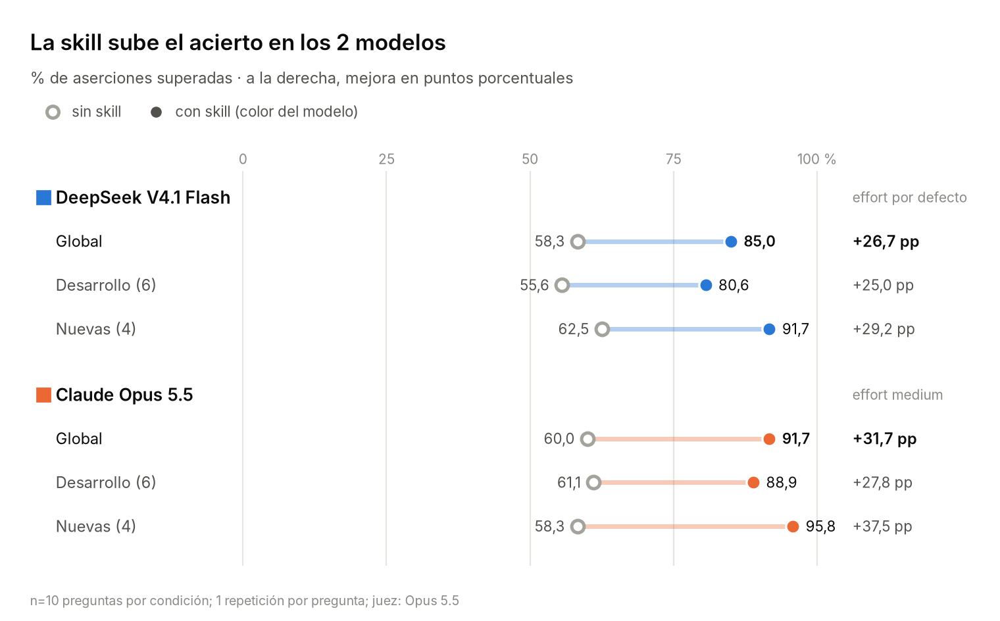
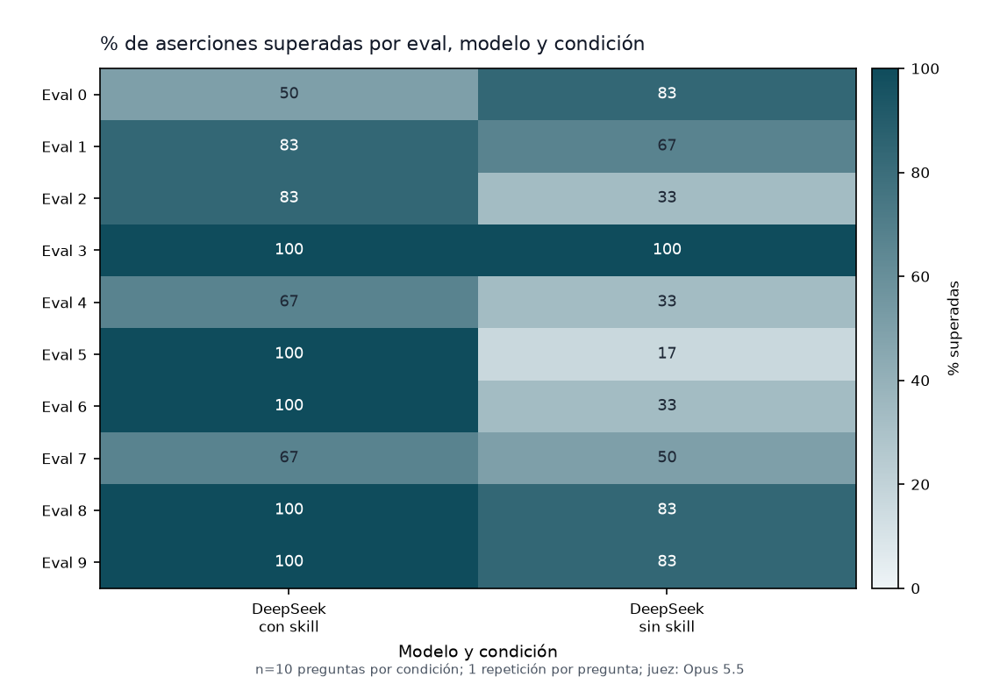

# normativa-uvigo-eeae

**Skill de agentes de IA para consultar la normativa de la Universidade de Vigo aplicable al profesorado de la EEAE y al doctorado (EIDO).**

[](LICENSE)
[](https://github.com/Pablomg02/uvigo-eeae-skill/releases)
[](#requisitos)

La skill responde dudas normativas del profesorado de la Escola de Enxeñaría Aeronáutica e do Espazo (EEAE) y de quien realiza el doctorado en la Universidade de Vigo: exámenes, guías docentes, POD y dedicación, permisos, contratos, tesis, art. 83, incompatibilidades, protección de datos y régimen disciplinario.

Se apoya en un **corpus local de 160 textos** (legislación estatal y gallega, convenio del PDI laboral, normativa de la UVigo, la EEAE y la EIDO), con un buscador y un comprobador que contrasta la vigencia en directo con el portal de la UVigo, el BOE y las webs de la Escola y la EIDO. Responde en español, **cita artículo y fuente** y declara explícitamente lo que no puede verificar.

> Si eres un agente de IA y vas a instalar esta skill, los pasos exactos están en [Instalación detallada para agentes de IA](#instalación-detallada-para-agentes-de-ia).

## Índice

- [Descripción general](#descripción-general)
- [Ejemplo de uso](#ejemplo-de-uso)
- [Compatibilidad](#compatibilidad)
- [Requisitos](#requisitos)
- [Instalación](#instalación)
- [Estructura del repositorio](#estructura-del-repositorio)
- [Benchmarks](#benchmarks)
- [Alcance y adaptación](#alcance-y-adaptación)
- [Limitaciones y aviso legal](#limitaciones-y-aviso-legal)
- [Mantenimiento y contribuciones](#mantenimiento-y-contribuciones)
- [Licencia](#licencia)
- [Instalación detallada para agentes de IA](#instalación-detallada-para-agentes-de-ia)

## Descripción general

La normativa universitaria cambia cada curso, parte de ella se publica en gallego y, sin artículo ni fecha, una respuesta no permite decidir. Esta skill está diseñada para **no responder de memoria**: localiza el texto en el corpus, lo lee completo, comprueba que sigue vigente y aplicable, y lo cita.

- **Respuestas trazables.** Cada afirmación jurídica va acompañada de norma, rango, fecha, artículo y enlace. Lo que no consta en el corpus ni en una fuente oficial se etiqueta como no verificado.
- **Búsqueda local.** `buscar.py` indexa los 160 textos y permite buscar por ámbito (curso, UVigo, EEAE, EIDO, estatal, Galicia), consultar un artículo completo (`--ver`), extraer tablas del PDF original (`--layout`) y listar el contenido disponible.
- **Comprobación de vigencia en directo.** `comprobar.py` contrasta las normas citadas con el portal de la UVigo, el BOE y las webs de la Escola y la EIDO, y avisa de cambios, anulaciones o versiones nuevas.
- **Guías docentes bajo demanda.** `guia.py` descarga la guía de cualquier materia de la EEAE y la cita con URL y fecha de consulta; no se responde sobre una materia de memoria.
- **Sin datos personales.** La skill no almacena información de nadie: el caso se plantea en la conversación y de ahí sale todo.

## Ejemplo de uso

Una vez instalada, basta con formular la pregunta en lenguaje natural. Por ejemplo:

> Soy profesor asociado y un alumno me pide cambiar la fecha del examen porque se va de congreso. ¿Puedo?

Formato de respuesta (recortado):

```
**Respuesta corta:** No / Depende de X — una frase.

**Fundamento**
- <Norma>, <rango y fecha>, art. X.Y: «cita literal breve». [enlace]

**Condiciones y excepciones:** plazos, requisitos, quién autoriza.

**Qué no he podido verificar:** (si aplica) huecos del corpus, norma de otro curso, tabla…

**Siguiente paso:** a quién preguntar o qué trámite hacer.
```

La versión empaquetada para la app de Claude es el archivo `.skill` de las [releases](https://github.com/Pablomg02/uvigo-eeae-skill/releases) (≈7 MB). El repositorio versiona únicamente los PDF imprescindibles (13 de 128); el resto se descarga bajo demanda cuando una consulta necesita una tabla o un documento escaneado.

## Compatibilidad

| Plataforma | Instalación | Estado |
|---|---|---|
| **Claude Code** (terminal, IDE, escritorio) | Plugin desde marketplace o enlace en `~/.claude/skills/` | Verificado |
| **Codex CLI** | `.agents/skills/` de usuario o de proyecto | Verificado |
| **OpenCode** | `.opencode/skills/`, `~/.config/opencode/skills/` o `~/.claude/skills/` | Verificado |
| **claude.ai / app de Claude** | Subida del archivo `.skill` | Documentado (requiere ejecución de código y acceso a red) |
| **ChatGPT** | Skills de workspace o ZIP en un Proyecto | Parcial: la alternativa sin Skills no ejecuta scripts |
| **Gemini CLI, Cursor, GitHub Copilot** | `.agents/skills/` (y `.claude/skills/`, según la herramienta) | No verificado en este repositorio |

## Requisitos

- **Python 3** (solo biblioteca estándar) para los scripts de búsqueda, comprobación y descarga de guías.
- **`pdftotext`** (poppler-utils) para extraer texto y tablas de los PDF; en entornos sin poppler, como la app de Claude, se usa `pdfplumber`.
- **Conexión a red** para la comprobación de vigencia en directo y la descarga de documentos bajo demanda. Es opcional: sin red, la skill responde con el corpus local y lo indica en la respuesta.
- **`pandoc`** únicamente para regenerar el corpus con las herramientas de mantenimiento (`tools/`), no para usar la skill.

## Instalación

### Claude Code

```bash
claude plugin marketplace add Pablomg02/uvigo-eeae-skill
claude plugin install normativa-uvigo-eeae@uvigo-eeae-skill
```

Alternativa manual: clonar el repositorio y enlazar `skills/normativa-uvigo-eeae` en `~/.claude/skills/normativa-uvigo-eeae`.

### Codex CLI

```bash
git clone https://github.com/Pablomg02/uvigo-eeae-skill ~/uvigo-eeae-skill
mkdir -p ~/.agents/skills
ln -s ~/uvigo-eeae-skill/skills/normativa-uvigo-eeae ~/.agents/skills/normativa-uvigo-eeae
```

Dentro de un proyecto, usar `.agents/skills/` en la raíz. Codex también admite enlaces simbólicos.

### OpenCode

```bash
git clone https://github.com/Pablomg02/uvigo-eeae-skill ~/uvigo-eeae-skill
mkdir -p ~/.config/opencode/skills
ln -s ~/uvigo-eeae-skill/skills/normativa-uvigo-eeae ~/.config/opencode/skills/normativa-uvigo-eeae
```

Dentro de un proyecto, usar `.opencode/skills/`, `.claude/skills/` o `.agents/skills/`.

### claude.ai / app de Claude

Descargar `normativa-uvigo-eeae.skill` de la última release y subirlo en **Customize → Skills → «Upload a skill»**. Activar «Code execution and file creation» y el acceso a red para los dominios `secretaria.uvigo.gal`, `www.boe.es`, `aero.uvigo.es` y `eido.uvigo.gal`.

### ChatGPT

Si el plan (Business, Enterprise, Healthcare o Edu) incluye Skills: **Skills → Create → Upload from your computer**. En caso contrario, adjuntar el ZIP de la release en un Proyecto y pegar el contenido de `SKILL.md` como instrucciones (ver [limitaciones](#limitaciones-y-aviso-legal)).

## Estructura del repositorio

```
.
├── skills/normativa-uvigo-eeae/    # Skill
│   ├── SKILL.md                    # Punto de entrada e instrucciones del agente
│   ├── scripts/                    # buscar.py, comprobar.py, guia.py, lib.py
│   ├── normativa/                  # Corpus por ámbito: curso, uvigo, eeae, eido, estatal, galicia
│   ├── references/                 # Mapa de temas, jerarquía normativa y huecos conocidos
│   └── data/                       # Índices, huellas y marcas de vigencia
├── benchmarks/                     # Arnés de evaluación, corrección y resultados
├── tools/                          # Mantenimiento del corpus (no viaja con la skill)
├── docs/img/                       # Gráficas de los benchmarks
└── .claude-plugin/                 # Manifiesto del plugin y del marketplace
```

## Benchmarks



**DeepSeek V4.1 Flash** (vía OpenCode), 2 de octubre de 2026: 10 preguntas × 2 condiciones (con y sin skill) × 1 repetición por pregunta = **20 ejecuciones**, corregidas por el juez **Claude Opus 5.5**. Con la skill, el acierto pasa de **58,3 % a 85,0 %** (**+26,7 puntos porcentuales**). Por grupos, en las 6 preguntas de desarrollo sube de 55,6 % a 80,6 %, y en las 4 nuevas —redactadas sin consultar `SKILL.md`— de 62,5 % a 91,7 %. La skill se activó en el 100 % de las ejecuciones con skill; la excepción es el eval 0, donde la respuesta sin skill (83,3 %) superó a la respuesta con skill (50,0 %) por fallos reales de esta última, documentados en la auditoría del juez.



El arnés permite incorporar Sonnet 5.5 y Opus 5.5 con `python3 benchmarks/run.py --models deepseek,sonnet,opus`, pero esta tanda se ejecutó solo con DeepSeek por coste. La metodología, el aislamiento, el coste real y las limitaciones están documentados en [`benchmarks/README.md`](benchmarks/README.md).

## Alcance y adaptación

La skill es específica de la UVigo, la EEAE y el doctorado (EIDO), pero su estructura —corpus con cabeceras de fuente y fecha, buscador, comprobador de vigencia, mapa de temas y jerarquía normativa— sirve de base para otras escuelas, facultades o universidades. Para adaptarla a otro centro, escribir a través de [pablomagarinos.es](https://pablomagarinos.es).

## Limitaciones y aviso legal

- **No está vinculada a la Universidade de Vigo** ni es una publicación oficial suya; los textos son fuentes oficiales de acceso público redistribuidas sin modificar (ver [`NOTICE.md`](NOTICE.md)).
- **No constituye asesoramiento jurídico.** Orienta y cita fuentes, pero no sustituye a la Asesoría Xurídica, la Vicerreitoría de Profesorado ni Recursos Humanos en decisiones con efectos sancionadores, contractuales o económicos.
- **El corpus es del 2026-10-01.** Que una norma figure como «validada» en el portal no significa que esté vigente hoy: antes de decidir, usar el comprobador en directo de la skill (`comprobar.py`) o consultar la fuente oficial.
- **Huecos conocidos:** la normativa de dedicación 2026/27 y la instrución de vacaciones 2026 no están publicadas; 8 documentos (7 PDF escaneados y un `.docx`) no tienen texto extraíble.
- **Cobertura limitada a la EEAE.** Otros centros tienen sus propios reglamentos, que no forman parte del corpus.

## Mantenimiento y contribuciones

- Actualización del corpus y puesta al día de cada curso: [`tools/README.md`](tools/README.md).
- Comunicación de normas desactualizadas o propuestas de adaptación: [`CONTRIBUTING.md`](CONTRIBUTING.md).
- Metodología de los benchmarks y reproducción: [`benchmarks/README.md`](benchmarks/README.md).

## Licencia

El código y las instrucciones propias de la skill están bajo licencia MIT ([`LICENSE`](LICENSE)); los textos normativos pertenecen a sus organismos emisores y se redistribuyen sin modificar (ver [`NOTICE.md`](NOTICE.md)).

## Instalación detallada para agentes de IA

Esta sección contiene todo lo necesario para instalar la skill sin leer el resto del documento. La skill reside en [`skills/normativa-uvigo-eeae/`](skills/normativa-uvigo-eeae/) y su punto de entrada es `SKILL.md`. Los comandos `git clone` y el marketplace remoto requieren que el repositorio esté publicado en GitHub; si no lo está, sustituir `https://github.com/Pablomg02/uvigo-eeae-skill` por la ruta local del checkout (en Claude Code vale `claude plugin marketplace add /ruta/al/checkout`). Tras instalar, la comprobación común es preguntar «¿Qué skills tienes disponibles?» y confirmar que aparece `normativa-uvigo-eeae` (con el plugin de Claude Code, `normativa-uvigo-eeae:normativa-uvigo-eeae`).

### Claude Code

Marketplace (recomendado; requiere el repositorio publicado):

```bash
claude plugin marketplace add Pablomg02/uvigo-eeae-skill
claude plugin install normativa-uvigo-eeae@uvigo-eeae-skill
claude plugin list
claude plugin details normativa-uvigo-eeae
```

Comprobación: `claude plugin list` muestra `normativa-uvigo-eeae@uvigo-eeae-skill` con `Status: ✔ enabled`, y `claude plugin details` muestra `Skills (1) normativa-uvigo-eeae`. En una sesión nueva, la skill instalada como plugin aparece en `claude -p` como `normativa-uvigo-eeae:normativa-uvigo-eeae` (namespace `plugin:skill`); con el enlace manual, como `normativa-uvigo-eeae`.

Alternativa manual (funciona con el repositorio clonado):

```bash
git clone https://github.com/Pablomg02/uvigo-eeae-skill ~/uvigo-eeae-skill
mkdir -p ~/.claude/skills
ln -s ~/uvigo-eeae-skill/skills/normativa-uvigo-eeae ~/.claude/skills/normativa-uvigo-eeae
```

Comprobación: en una sesión nueva, `/skills` la lista como `normativa-uvigo-eeae` (o `claude -p "¿Qué skills tienes disponibles?"`).

### Codex CLI

```bash
git clone https://github.com/Pablomg02/uvigo-eeae-skill ~/uvigo-eeae-skill
mkdir -p ~/.agents/skills
ln -s ~/uvigo-eeae-skill/skills/normativa-uvigo-eeae ~/.agents/skills/normativa-uvigo-eeae
```

Para un solo proyecto, enlazar en `.agents/skills/` de su raíz. Comprobación: `codex exec --skip-git-repo-check "¿Qué skills tienes disponibles? Responde solo con la lista de nombres." < /dev/null` debe incluir `normativa-uvigo-eeae`; en la TUI, `/skills` o la mención `$normativa-uvigo-eeae`. El flag `--skip-git-repo-check` es necesario si el directorio de trabajo no es un repositorio git (`codex exec` aborta con «Not inside a trusted directory»); `< /dev/null` evita que espere entrada por stdin cuando se lanza desde un script o un agente.

### OpenCode

```bash
git clone https://github.com/Pablomg02/uvigo-eeae-skill ~/uvigo-eeae-skill
mkdir -p ~/.config/opencode/skills
ln -s ~/uvigo-eeae-skill/skills/normativa-uvigo-eeae ~/.config/opencode/skills/normativa-uvigo-eeae
```

Para un solo proyecto, usar `.opencode/skills/` (OpenCode también lee `.claude/skills/`, `.agents/skills/` y, como global, `~/.claude/skills/`). Comprobación: `opencode run "¿Qué skills tienes disponibles?"` debe incluir `normativa-uvigo-eeae`.

### claude.ai / app de Claude (documentado, no verificado en este repositorio)

1. Descargar `normativa-uvigo-eeae.skill` de la release del repositorio (o generar `dist/normativa-uvigo-eeae.skill` con `python3 tools/empaquetar.py`).
2. **Customize → Skills → «+» → «+ Create skill» → «Upload a skill»** y subir el `.skill` (es un ZIP con la carpeta de la skill dentro).
3. En **Settings → Capabilities**, activar «Code execution and file creation» y «Allow network egress»; añadir como dominios permitidos `secretaria.uvigo.gal`, `www.boe.es`, `aero.uvigo.es` y `eido.uvigo.gal`.
4. Comprobación: la skill aparece en Customize → Skills; al preguntar por normativa, debe citar artículo y fuente y usar sus scripts.

### ChatGPT (documentado, no verificado en este repositorio)

1. Si el plan es Business, Enterprise, Healthcare o Edu y el workspace incluye Skills: **Skills → Create → Upload from your computer** y subir el ZIP de la release.
2. En caso contrario: crear un Proyecto (o GPT personalizado), adjuntar el ZIP como archivo, pegar el contenido de `SKILL.md` en las instrucciones y activar el análisis de datos.
3. Límites de la alternativa: no ejecuta `buscar.py` ni `comprobar.py`, por lo que no hay búsqueda en el corpus ni comprobación de vigencia en directo; solo puede leer los archivos del ZIP y buscar en la web.

### Otros agentes compatibles con Agent Skills

Gemini CLI (`~/.gemini/skills/` o `.agents/skills/`, y `gemini skills install`), Cursor (`~/.cursor/skills/` o `.agents/skills/`; también lee `.claude/skills/` y `.codex/skills/`) y GitHub Copilot (`.github/skills`, `.claude/skills`, `.agents/skills`, `~/.copilot/skills` o `~/.agents/skills`) usan el mismo formato. Basta con clonar el repositorio y enlazar `skills/normativa-uvigo-eeae` en la ruta de skills correspondiente. Las rutas proceden de la documentación de cada herramienta y no se han verificado en este repositorio.
